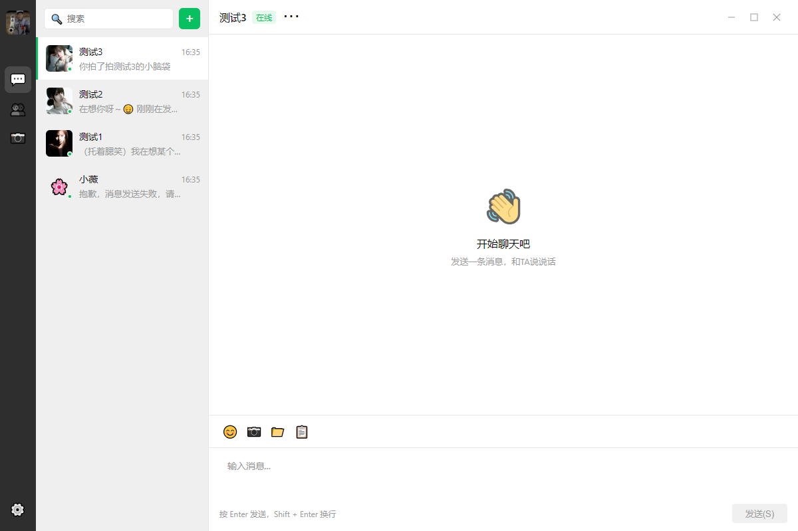

# 拟恋 (ni-lian)

AI 虚拟伴侣桌面应用 —— 基于 Electron + React + TypeScript。



## 功能

- 多角色 AI 聊天（支持 MiMo / DeepSeek / OpenAI）
- 流式对话输出，模拟真人打字节奏
- 知识库系统：5 个 MD 文件自动生成（人设、用户画像、对话摘要、风格学习、聊天记录）
- 记忆系统：短期记忆 + 长期记忆 + 关键词检索
- 情感状态机：10 维情感建模，会生气、会和好
- 学习系统：规则引擎（实时） + 模型分析器（周期）
- 人设模板：傲娇女友、温柔姐姐、搞笑担当
- 朋友圈：AI 自动生成动态 + 互动
- 消息引用、拍一拍、红包、表情包
- 主动消息：早安、晚安、想你提醒

## 技术栈

| 层 | 技术 |
|---|------|
| 框架 | Electron 33 |
| 前端 | React 19 + TypeScript + Zustand |
| 构建 | electron-vite |
| 配置 | YAML |
| 打包 | electron-builder (NSIS) |

## 项目结构

```
src/
├── main/                # Electron 主进程
│   ├── engine/          # 对话引擎、模型路由、人类化
│   ├── memory/          # 短期/长期记忆、摘要
│   ├── knowledge/       # 知识库生成（5 个 MD 文件）
│   ├── learning/        # 规则引擎、模型分析器
│   ├── emotion/         # 情感状态机
│   ├── character/       # 角色管理、人设模板
│   ├── proactive/       # 主动消息调度
│   ├── social/          # 朋友圈生成
│   ├── ipc/             # IPC 通信处理
│   └── store/           # 数据持久化
├── renderer/            # React 前端
│   ├── components/      # UI 组件
│   ├── stores/          # 状态管理
│   ├── hooks/           # 自定义 Hook
│   └── styles/          # 样式
├── preload/             # 预加载脚本
└── shared/              # 共享类型和常量
```

## 快速开始

```bash
# 安装依赖
npm install

# 开发模式
npm run dev

# 打包 Windows exe
npm run build:win
```

## 配置 API

1. 复制 `.env.example` 为 `.env`
2. 填入你的 API Key：

```env
DEEPSEEK_API_KEY=sk-xxx
MIMO_API_KEY=sk-xxx
OPENAI_API_KEY=sk-xxx
```

3. 或在应用内设置页为每个角色单独配置 API Key

## 数据存储

所有数据存储在本地：

- 打包后：`%APPDATA%/ni-lian/`
- 开发模式：`./data/`

包含角色配置、聊天记录、知识库、情感状态等。

## License

MIT